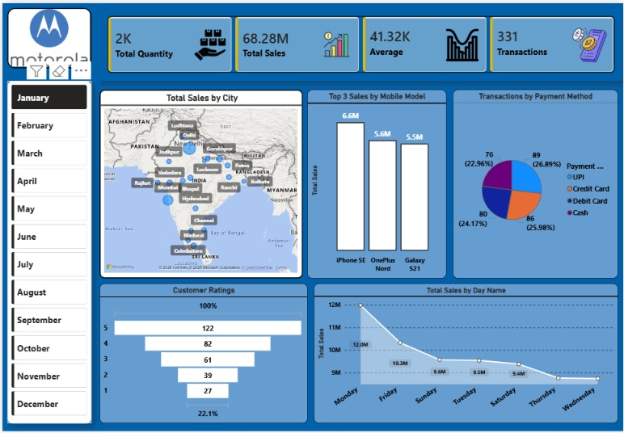

# 📊 Motorola Sales Dashboard

An interactive Power BI Dashboard designed to analyze Motorola mobile sales performance across different cities, models, payment methods, customer ratings, and sales trends.



---

## 🚀 Project Overview

This dashboard provides a comprehensive visualization of Motorola sales data and helps stakeholders monitor:

- Total Sales Performance
- Quantity Sold
- Average Sales Value
- Total Transactions
- City-wise Sales Distribution
- Model-wise Sales Analysis
- Payment Method Usage
- Customer Ratings
- Day-wise Sales Trends

---

## 📌 Key Metrics

| Metric | Value |
|----------|----------|
| Total Quantity | 2K |
| Total Sales | 68.28M |
| Average Sales | 41.32K |
| Transactions | 331 |

---

## 📈 Dashboard Features

### 1. Sales KPIs
- Total Quantity Sold
- Total Revenue Generated
- Average Sales Value
- Total Number of Transactions

### 2. City-wise Sales Analysis
- Interactive map visualization
- Identify top-performing cities
- Geographic sales distribution

### 3. Top Selling Mobile Models
- iPhone SE
- OnePlus Nord
- Galaxy S21

### 4. Payment Method Analysis
- UPI
- Credit Card
- Debit Card
- Cash

### 5. Customer Rating Distribution
- Ratings from 1 to 5 stars
- Customer satisfaction analysis

### 6. Sales Trend Analysis
- Day-wise sales performance
- Peak and low sales days identification

### 7. Monthly Filters
Users can analyze sales data month-wise using the sidebar slicer:
- January to December

---

## 🛠️ Tools & Technologies Used

- Power BI
- Data Visualization
- Business Intelligence (BI)
- Data Analytics

---

## 📂 Project Structure

```text
Motorola-Sales-Dashboard/
│
├── images
├── Motorola_Sales_Dashboard.pbix
└── README.md
```

---

## 🎯 Business Insights

- Track overall business performance.
- Identify top-selling mobile models.
- Analyze customer purchasing behavior.
- Monitor preferred payment methods.
- Understand geographical sales trends.
- Improve decision-making through data-driven insights.

---

## 📸 Dashboard Snapshot


---

## 🔮 Future Improvements

- Add Year-wise Comparison
- Forecast Future Sales
- Product Category Analysis
- Regional Performance Dashboard
- Customer Segmentation

---

## 👨‍💻 Author

**Aqdas Khan**

B.Tech Computer Engineering Student  
VIT Pune

---